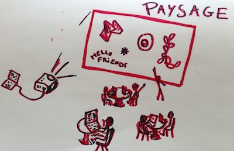

Paysage (alpha - contributors welcome)
=======
***Paysage*** *is a visual shared playground for code.* 

With Paysage, kids (and adults!) live code from their own computer, laptops, tablets, phones, with a variety of IDE and editors. Each program is shared and rendered live on a visual playground. The playground accessible via an URL.

The Paysage project do not try to invent a new IDE / code editor for kids. There is already many of them, with more launching everyday.

We aim is to solve a very specific use case: 
**Let 10 kids in the same room, with a few more kids online, code together on the same visual playground.**

========
###Demo

[http://paysage.herokuapp.com/boumsplash](http://paysage.herokuapp.com/boumsplash) (playground)  
[http://paysage.herokuapp.com/programmer.html](http://paysage.herokuapp.com/programmer.html) (test code editor) 

- Open both pages (on different computers for more fun), 
- Write Processing.js code on the programmer, click the button to send the code to the playground. Your code is assigned a unique ID (the editor default to 1).
- Change the ID to create a new object, or to update a given object.
- Ask a friend to open another programmer page to code together on the same playground 

(all code is lost on close, no persistence for now, just live send)

The demo is continuously deployed from the GitHub repository, so your pull requests are welcome, and will be live in minutes once accepted :-)

========
#### Server, Playground, Editor(s)
The **Paysage server** is at the moment NodeJs / Express that listen to the programmer page and send code to the renderer using socket.io.
A Python implementation would be interesting for easy local installation.

The **Paysage playground** (renderer) is a JS HTML CSS page using Processing.js

**Paysage editors** implementations will be in a variety of languages, and can be purely textual editors or visual editors or anything in between. For example Snap! BYOB could be extended to be a Paysage live code editor.  A watcher for text editors could push code to the Paysage server at each save. A Paysage editor for babies, using only shapes to touch would be very cool, too. *At the moment, we use a simple HTML form as the alpha test editor: programmer.html*

=======

####TO DO

- creating a random unique playground for a group when accessing the home (like etherpad)
- the editor can edit a specific playground
- each code object is uniquely identified
- code objects for a playground are persistent and reloaded from the server
- the editor can request a list of current active object, and then edit one
- any client editor can communicate with the server using a simple HTTP API 

======

####Note on the collaborative vision of Paysage:

Paysage do not impose social rules on the users. Anyone can edit everything if they want to! 

Just like writing on Etherpad or Google Docs, users have to evolve their own social rules according to their goals and needs. Yes, pranks and edit wars will happen :-) but it’s part of the process. 

In a sandbox (a real one at the park :-) a kid can destroy the castle another built, and it's the role of other kids and adults to build their own rules about what is allowed and what is not.

In that sense Paysage is also a playground to learn and explore open collaboration.

